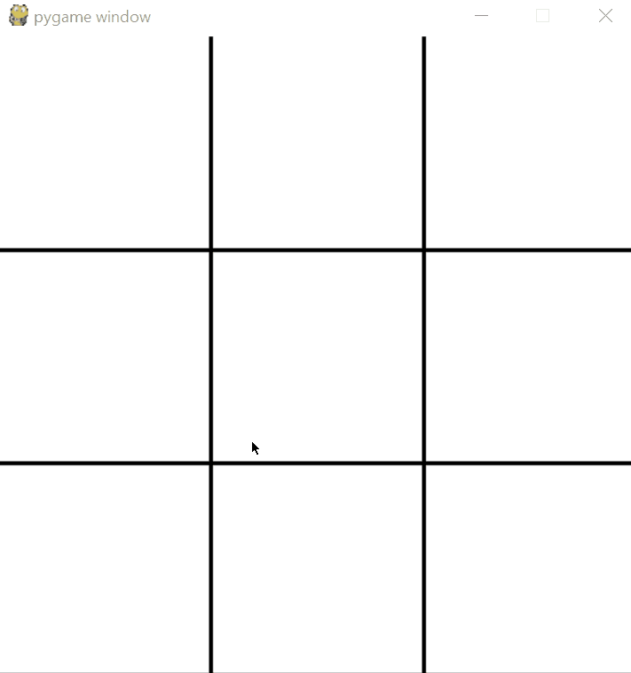

# TicTacToe-AI

A tic tac toe game with a minmax algorithm implementation.

    

## How to play?

Simply type `python game.py` in a terminal and you're good to go!

You play the cross and the AI plays the circle.

## Minimax algorithm

The AI agent is using a minimax algorithm to make its move. Follow [this link](https://en.wikipedia.org/wiki/Minimax) for the wikipedia article on this algorithm.

Basically, the algorithm works because we are in a *zero-sum game*, which means that every state of the game is visible to all the players. Becauser of that, the agent can explore all the possible outcome at a given state and evaluate which move to make to *minimize* its chance of losing. 

Because the agent always tries to minimize its loss, you'll often make a draw with it.

## Dependencies 

Simply type:

    pip install -r requirements.txt

or see the following:

- pygame==1.9.4
- numpy==1.15.4

